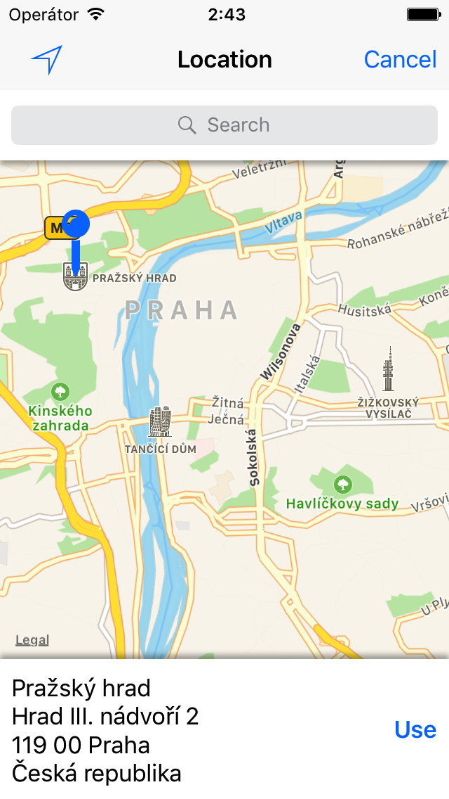
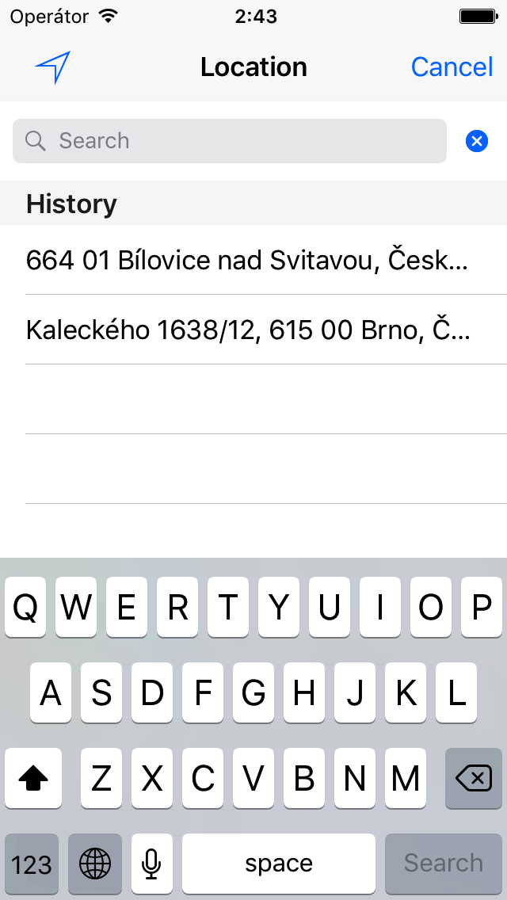
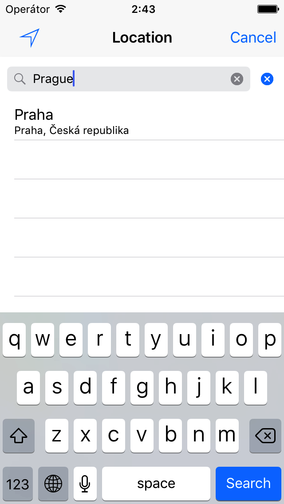
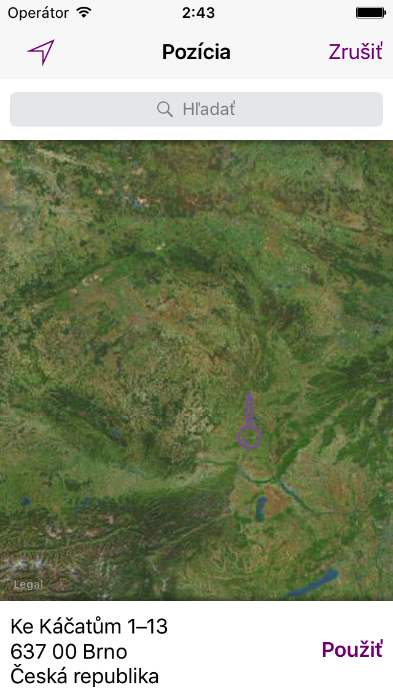

# MZLocationPicker

Simple to use location picker. As for users, so for developers. 

Default              | History              | Search               | Customized
---------------------|----------------------|----------------------|---------------------
 |  |  | 

[](http://cocoapods.org/pods/MZLocationPicker)
[](http://cocoapods.org/pods/MZLocationPicker)
[](http://cocoapods.org/pods/MZLocationPicker)

* [Features](#features)
* [Example](#example)
* [Installation](#installation)
* [Usage](#usage)
* [Known Issues](#known-issues)
* [Author](#author)
* [License](#license)

## Features
* Reverse geocoding for location chosen in map
* Location textual search
* History of chosen locations
* Multiple map types
* Custom annotations/pins
* Custom tint color
* Support for localizations
* Landscape as well as portrait orientation

## Example

To run the example project, clone the repo, and run `pod install` from the Example directory first.

## Installation

MZLocationPicker is available through [CocoaPods](http://cocoapods.org). To install
it, simply add the following line to your Podfile:

```ruby
pod "MZLocationPicker"
```

## Usage 

For simple usage just implement MZLocationPickerDelegate methods and present picker like this:

```ruby
let picker = MZLocationPickerController()
picker.delegate = self
present(picker, animated: true, completion: nil)
```

However, you can also customize the picker a bit more:

```ruby
let picker = MZLocationPickerController()
picker.delegate = self
picker.tintColor = .purple
picker.annotation.image = #imageLiteral(resourceName: "custom_pin")
picker.annotation.centerOffset = CGPoint(x: 0, y: 24)
picker.mapType = .satellite
picker.translator = self
present(picker, animated: true, completion: nil)
```

## Known Issues

- When map type is flyover, search is not displayed correctly. For best functionality, avoid using flyover map types.

## Author

Michal Ziman, michalziman@me.com

## License

MZLocationPicker is available under the MIT license. See the LICENSE file for more info.
